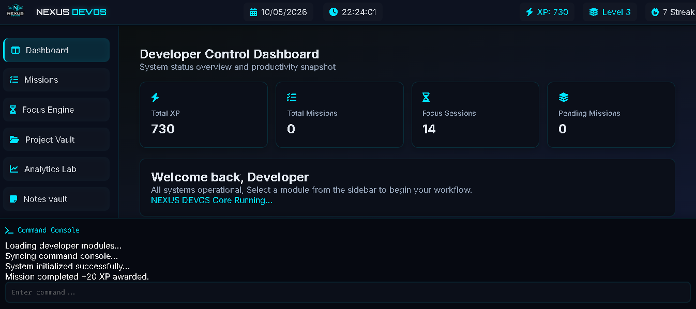
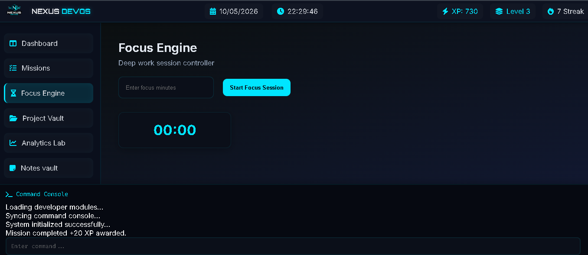
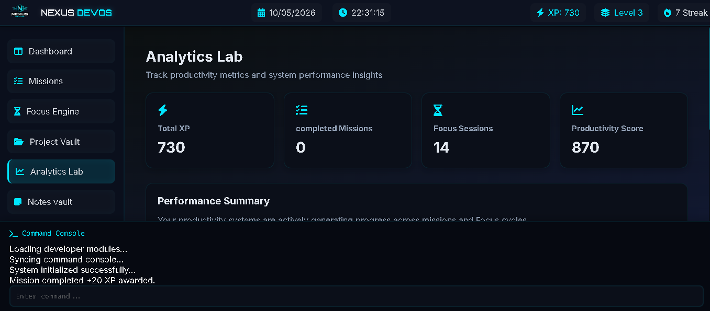
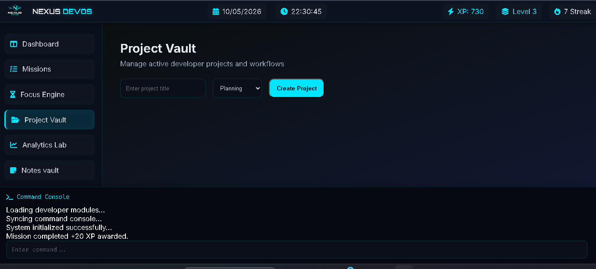
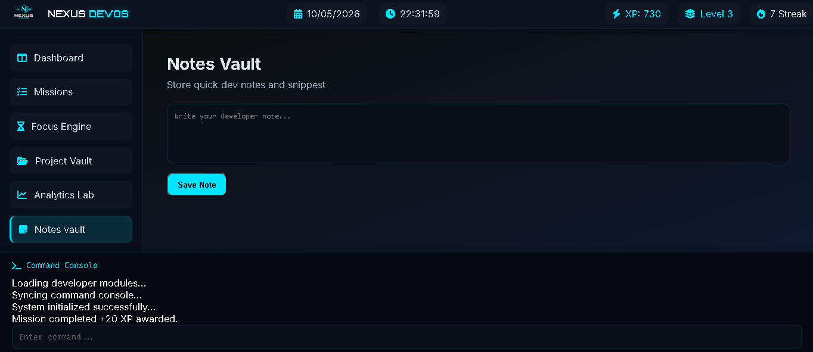

# NEXUS DEVOS

A futuristic developer productivity dashboard built using pure HTML, CSS, and JavaScript.

NEXUS DEVOS is designed as a cyber-themed "Developer Operating System" focused on productivity, focus management, project tracking, analytics visualization, and modular UI architecture.

---

## Features

### Developer Dashboard

* Dynamic productivity overview
* Live statistics cards
* XP tracking system
* Responsive layout

### Mission Control

* Create, complete, and delete missions
* XP reward system
* Custom modal input system
* Persistent local storage support

### Focus Engine

* Deep work countdown timer
* Focus session tracking
* XP rewards after completion
* Responsive timer UI

### Project Vault

* Create and manage projects
* Project status tracking
* Dynamic rendering system

### Analytics Lab

* Productivity analytics
* Dynamic activity bars
* Animated dashboard cards
* Live calculated metrics

### Notes Vault

* Save personal developer notes
* Local storage persistence
* Real-time rendering system

### Terminal Console

* Live temporary terminal logs
* Auto-clearing log system
* Cyber-themed command console

---

## Tech Stack

* HTML5
* CSS3
* Vanilla JavaScript
* LocalStorage API
* Flexbox
* Responsive Design

---

## UI Highlights

* Cyberpunk-inspired dark theme
* Smooth screen transitions
* Premium hover animations
* Custom scrollbar styling
* Toast notification system
* Responsive dashboard layout
* Animated module switching

---

## Screenshots

### Dashboard

### Mission Control

### Focus Engine

### Analytics Lab

### Project Vault

### Notes Vault

---

## Project Architecture

The project follows a modular frontend structure:

* Reusable utility functions
* Dynamic DOM rendering
* Modular screen loading
* Persistent application state
* Shared animation system
* Responsive UI architecture

---

## Future Improvements

* User authentication
* Database integration
* Real analytics charts
* Drag-and-drop task management
* Theme customization
* Cloud sync support

---

## Live Demo
https://nexus-devos.vercel.app/

---

## Author

Vedant Shinde

---
